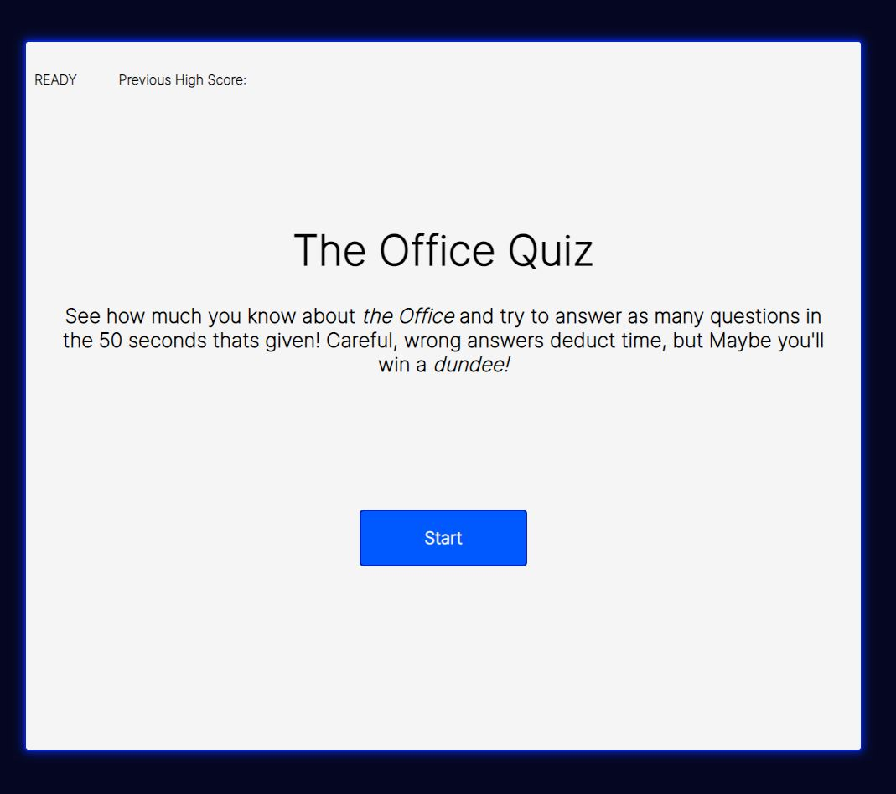

# TheOfficeJavascriptQuiz

## Description

-A Quiz created to test your office trivia knowledge.

## Changes Made
- Created a quiz application based off the show "The Office"
- Created functioning 50 second timer that subtracts time when answer is wrong.
- Added function when choice is picked new question and choices populate.
- Added alerts for if wrong or correct choice is picked.
- Once timer is done or questions are answered added screen to submit score and initials to local storage.
- Added Proper Semantic elements in HTML, JS and CSS Files.
- Organized HTML and CSS to follow a logical order.

## Table of Contents

- [Usage](#usage)
- [Credits](#credits)
- [License](#license)

## Usage

Link: https://isaacfalcon.github.io/TheOfficeJavascriptQuiz/

## Credits

https://www.youtube.com/watch?v=riDzcEQbX6k&t=612s

https://developer.mozilla.org/en-US/

## License

MIT License

Copyright (c) [2022] [Isaac Falcon]

Permission is hereby granted, free of charge, to any person obtaining a copy
of this software and associated documentation files (the "Software"), to deal
in the Software without restriction, including without limitation the rights
to use, copy, modify, merge, publish, distribute, sublicense, and/or sell
copies of the Software, and to permit persons to whom the Software is
furnished to do so, subject to the following conditions:

The above copyright notice and this permission notice shall be included in all
copies or substantial portions of the Software.

THE SOFTWARE IS PROVIDED "AS IS", WITHOUT WARRANTY OF ANY KIND, EXPRESS OR
IMPLIED, INCLUDING BUT NOT LIMITED TO THE WARRANTIES OF MERCHANTABILITY,
FITNESS FOR A PARTICULAR PURPOSE AND NONINFRINGEMENT. IN NO EVENT SHALL THE
AUTHORS OR COPYRIGHT HOLDERS BE LIABLE FOR ANY CLAIM, DAMAGES OR OTHER
LIABILITY, WHETHER IN AN ACTION OF CONTRACT, TORT OR OTHERWISE, ARISING FROM,
OUT OF OR IN CONNECTION WITH THE SOFTWARE OR THE USE OR OTHER DEALINGS IN THE
SOFTWARE.

---

## Badges

